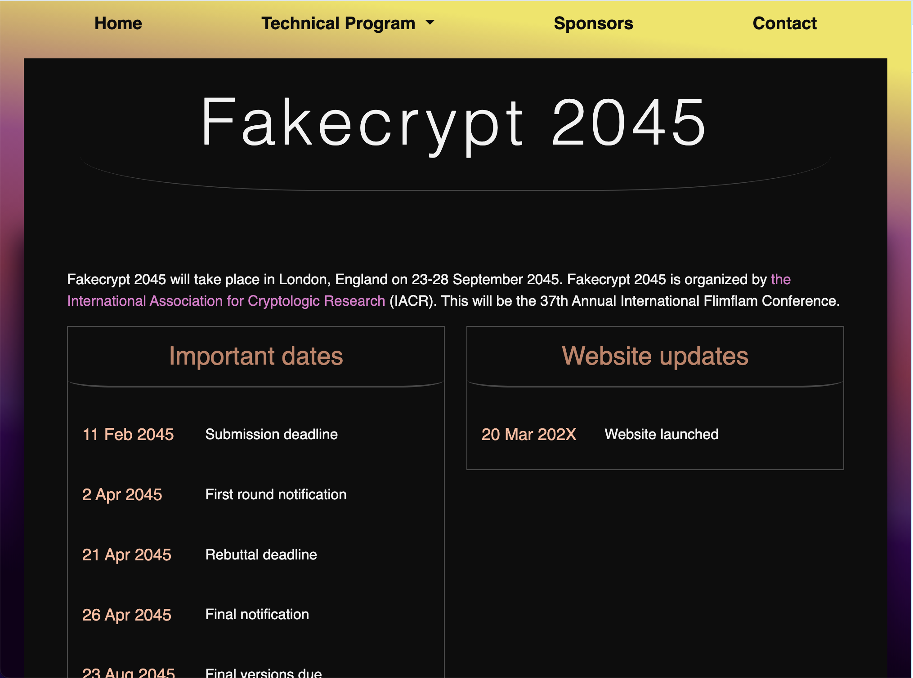
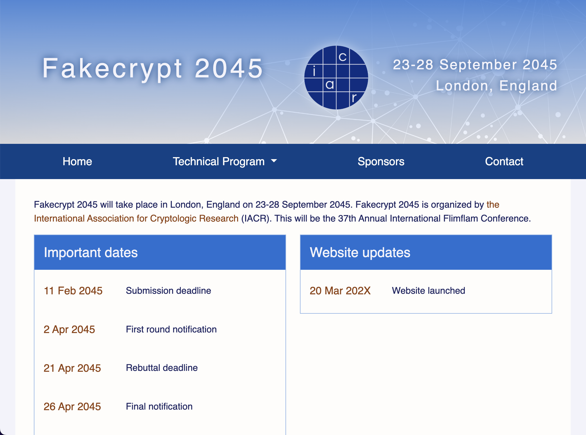
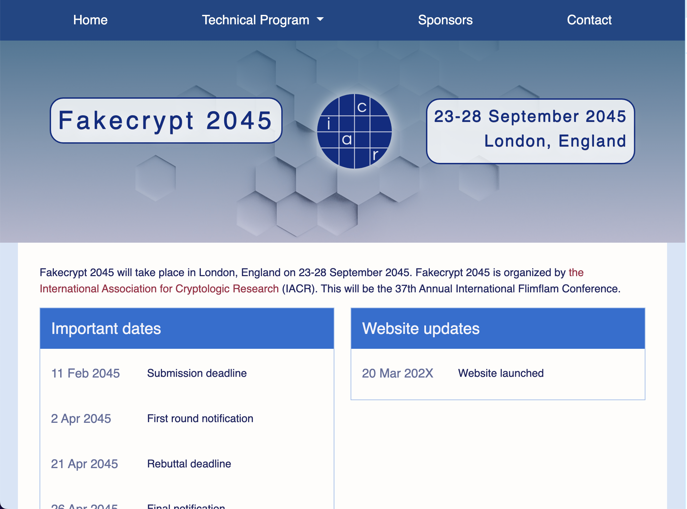
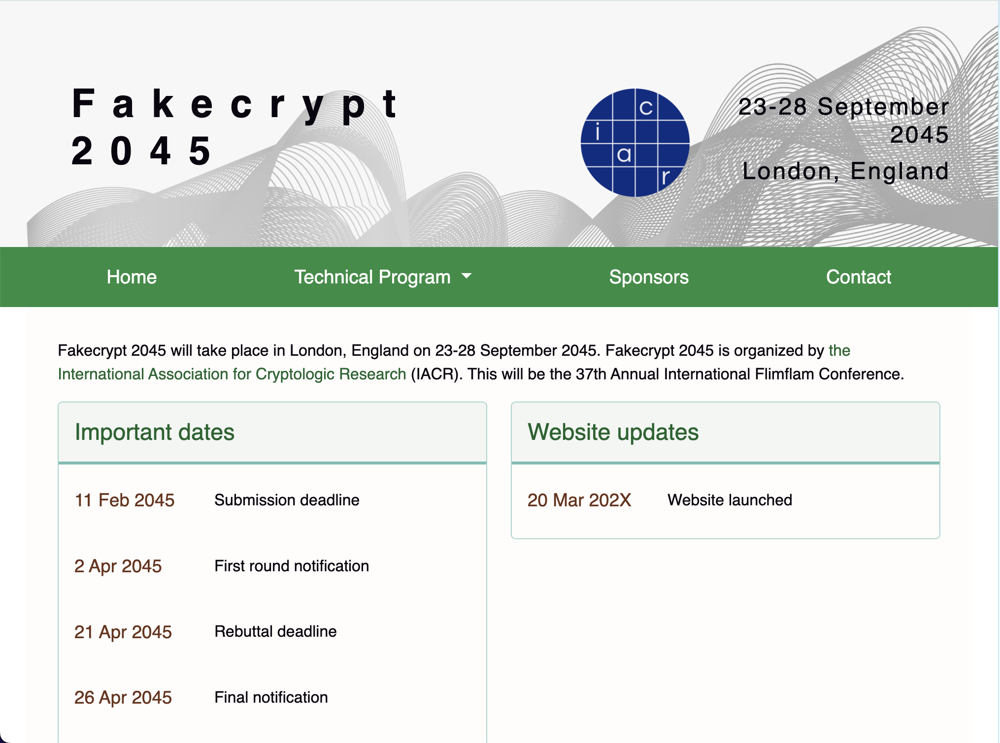
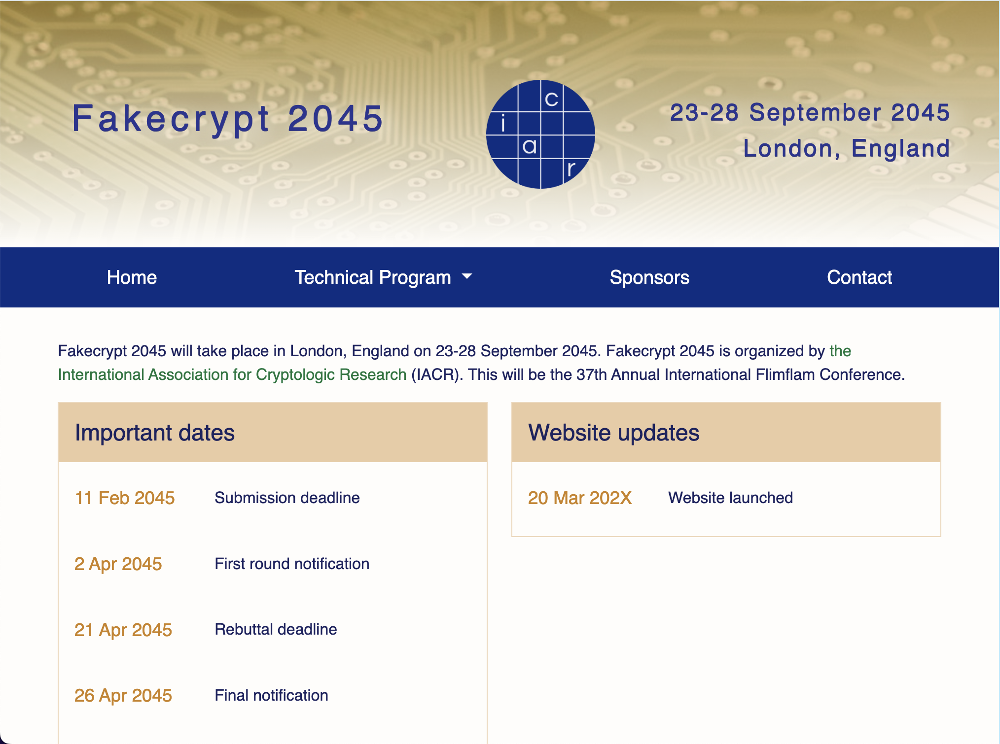
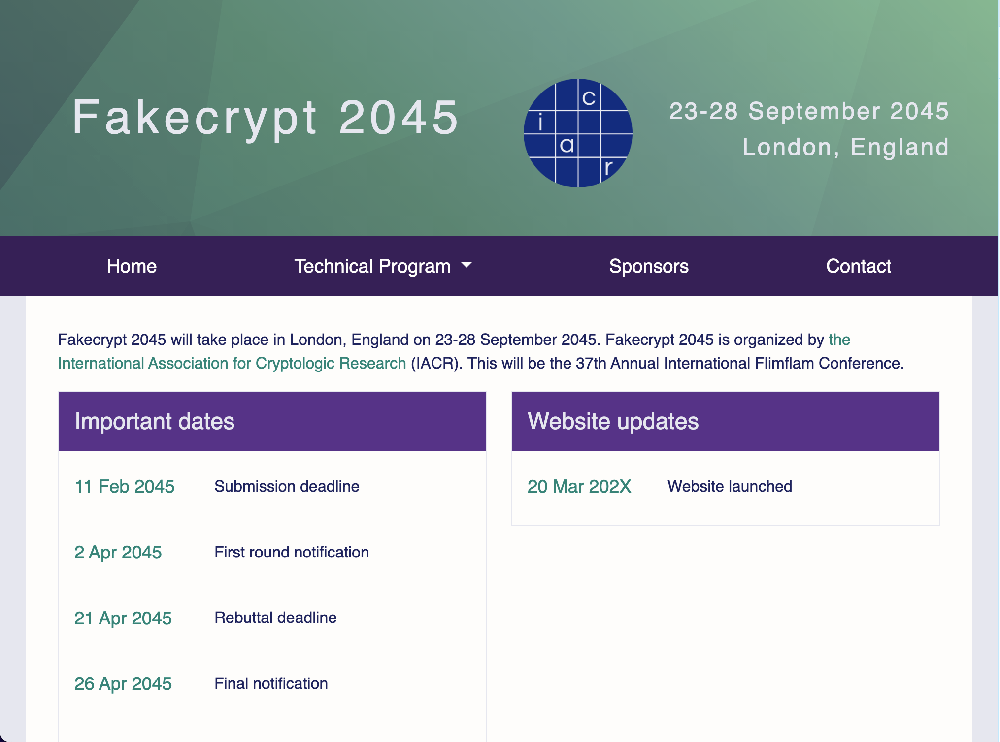
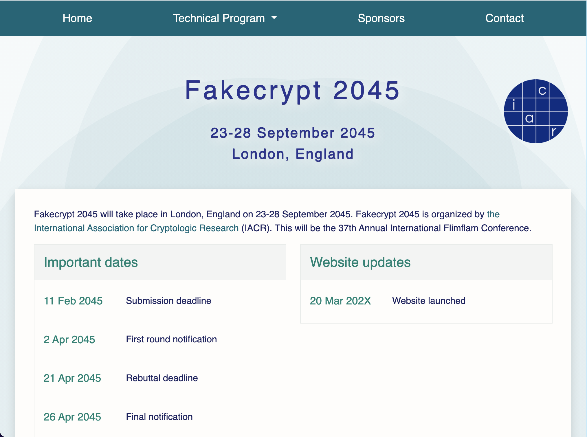

This template is intended for all IACR conference websites (Crypto, Asiacrypt, Eurocrypt, CHES, FSE, PKC, RWC, and TCC). If you would like to use this for another event, see the [non-IACR events section](#non-iacr-events).

> [!CAUTION]
> :japanese_ogre: **DO NOT COPY OVER OLD CONFERENCE WEBSITES FROM YEAR TO YEAR!** :japanese_ogre: 

This template gets regular updates for bug fixes, performance, formatting, etc. The old templates are not compatible with the current version. Feature requests are welcome via [Github Issues](https://github.com/IACR/conference-template/issues/new) or you can contact [Kay](https://github.com/kaymckelly).

If you're an intermediate to advanced user and/or a confident DIYer, check out the [comprehensive guide](#comprehensive-guide). Remember, it's open source so there's no warranty. You break it, that's what [git blame](https://www.atlassian.com/git/tutorials/inspecting-a-repository/git-blame) is for. :octocat:

---
# TABLE OF CONTENTS
- [TABLE OF CONTENTS](#table-of-contents)
- [QUICKSTART GUIDE](#quickstart-guide)
  - [Add conference name, dates, \& location](#add-conference-name-dates--location)
  - [Change contact info](#change-contact-info)
  - [Update call for papers](#update-call-for-papers)
  - [Add the program committee](#add-the-program-committee)
  - [Update nav as pages are added](#update-nav-as-pages-are-added)
  - [Update code of conduct](#update-code-of-conduct)
- [AFTER THE QUICKSTART](#after-the-quickstart)
- [NON-IACR EVENTS](#non-iacr-events)
- [COMPREHENSIVE GUIDE](#comprehensive-guide)
  - [Dev environment setup](#dev-environment-setup)
  - [Structure of JSON files](#structure-of-json-files)
    - [How to create JSON files](#how-to-create-json-files)
    - [What's in `metadata.json`](#whats-in-metadatajson)
    - [What's in `comm.json`](#whats-in-commjson)
    - [What's in `papers.json`](#whats-in-papersjson)
    - [What's in `program.json`](#whats-in-programjson)
  - [Individual pages](#individual-pages)
    - [Add a new page](#add-a-new-page)
    - [Delete a page](#delete-a-page)
    - [Special instructions for `travel.php`](#special-instructions-for-travelphp)
  - [Customization](#customization)
    - [Themes \& colors](#themes--colors)
    - [Change header image](#change-header-image)

---

# QUICKSTART GUIDE
These are the minimum initial changes you need to make to deploy the website. You will be working with `includes/nav.php`, `json/metadata.json`, `callforpapers.php`, and `contact.php`. (There is additional information about `json/metadata.json` in the [what's in `metadata.json`](#whats-in-metadatajson) section in the comprehensive guide.)

> [!IMPORTANT]
> Do not underestimate the amount of work a conference website requires. The [after the quickstart](#after-the-quickstart) section will give you a rough idea. There is also a [comprehensive guide](comprehensiveGuide.md) for more advanced usage.

## Add conference name, dates, & location
Per the [IACR general chair guidelines](https://iacr.org/docs/genchair.pdf), you must [submit your event](https://www.iacr.org/events/edit.php) to the calendar of events. Please note that you should include the presumed URL of the website, even though it is not yet available. As an example, for Crypto 2026, the URL would be https://crypto.iacr.org/2026/.

Once the event has been approved and is visible on the IACR website, you can [construct your metadata.json file](https://www.iacr.org/cryptodb/pc/). **You cannot put up the website prior to the event being approved.** Event approval is required in order to construct your `metadata.json` file, which in turn is required for the conference website.

## Change contact info
In `json/metadata.json`, you will add the names of the general and program chair(s). These will then appear on multiple pages across the site. You will also need to update the contact email addresses on `contact.php`.

## Update call for papers
`callforpapers.php` is one of the pages that is initially included in the `includes/nav.php` and will need to be updated. It has generic information about stipends, awards, and the paper review schedule. All paper submission information should be added to `papersubmission.php`.

## Add the program committee
Using the [program committee creation form](https://www.iacr.org/cryptodb/pc/), you will generate your `comm.json`. After adding your `comm.json`, check that the program committee renders correctly on `callforpapers.php`. Please do not attempt to make your `comm.json` from scratch; the ID numbers that are supplied by the aforementioned [program committee creation form](https://www.iacr.org/cryptodb/pc/) are used in acknowleding committee involvement on CryptoDB. Maybe you can be the next person with [the most IACR program committee memberships](https://www.iacr.org/cryptodb/data/service.php)?

## Update nav as pages are added
When you first clone the site, the only pages that are visible in the nav are `index.php`, `callforpapers.php`, `sponsors.php`, and `contact.php`. As you add additional pages to your website, you also need to update `includes/nav.php`. 

## Update code of conduct
Section 8.10 of the [IACR general chair guidelines](https://iacr.org/docs/genchair.pdf) requires an up-to-date code of conduct for each conference. You should edit `conduct.php` accordingly. Sections that need editing will show up in red on the page because they are tagged with a class called “editMe”. This class is used throughout the site to indicate sections that need to be edited prior to launch.

<div style="text-align:right;">
<a href="#table-of-contents">Back to top</a>
</div>

---

# AFTER THE QUICKSTART
This is a rough chronological list of what you will need to do after you have set up the initial website by completing the [quickstart guide](#quickstart-guide):
1. Add paper submission information
2. Open submission server and add the link to it
3. Add accepted papers
4. Add call for artifacts or affiliated events, if applicable
5. Add venue & travel information
6. Add tourism information, if applicable
7. Add hotel and visa information
8. Add financial support information page
9. Add affiliated or co-located events pages, if applicable
10. Add awards and invited talks pages, if applicable
11. Add an updated code of conduct page
12. Add registration information
13. Open registration server and add link
14. Add the program using [the program editor](https://www.iacr.org/tools/program)
15. Add rump session page, if applicable
16. Update the program as there are changes to the schedule, talk title, and/or speakers
17. Add session chairs, slides, paper links, and speakers to the program
18. Add Zoom links if applicable, as well as links to session/talk videos

During the conference, you will also need to:
* Add announcements to main page, if applicable
* Update the program if there are last-minute schedule changes
* Open rump session submissions and add link
* Add rump session program once finalized
* Update author slides as they come in (some authors really leave it until the last minute :weary:)

In addition to these steps, you may need to:
* Update the sponsors page as additional sponsorships come in
* Add a website update if there is a major schedule change or announcement

All this to say: do not underestimate the amount of work required to maintain the conference website.

<div style="text-align:right;">
<a href="#table-of-contents">Back to top</a>
</div>

---

# NON-IACR EVENTS
While this template is not designed specifically for use by non-IACR conferences, it can certainly be used that way. If you would like to use this template for conferences outside of IACR, you will need to [load Bootstrap via CDN](https://getbootstrap.com/docs/5.3/getting-started/introduction/#cdn-links) in `includes/head.php` and `includes/footer.php`, rather than directly from iacr.org as it is currently written. You can also hire Kay on a freelance basis to handle your conference website, subject to her availability.

<div style="text-align:right;">
<a href="#table-of-contents">Back to top</a>
</div>

---

# COMPREHENSIVE GUIDE
Detailed in this section are the types of things you can choose to handle yourself or you can pay Kay to do. It's open source so there's no warranty. You break it, that's what [git blame](https://www.atlassian.com/git/tutorials/inspecting-a-repository/git-blame) is for. :octocat:

You do not need to know Bootstrap per se, though if you are interested in doing more with the template, checkout out [Bootstrap's documentation](https://getbootstrap.com/docs/5.3/getting-started/introduction/). At a basic level, Bootstrap is a framework that helps improve the appearance and organization of a website. The template is built to load Bootstrap straight from iacr.org. **If you are using the template for a non-IACR conference you need to [load Bootstrap via CDN](https://getbootstrap.com/docs/5.3/getting-started/introduction/#cdn-links).**

## Dev environment setup
You will need to have [PHP](https://www.php.net/manual/en/install.php) installed, as it provides a basic server that is useful for testing. PHP is already installed on the iacr.org machine, but it's safest to work on your local machine. Ideally you will work with Github for version control and push changes directly to the IACR server when you are ready to launch.

In order to get started with the template, open a shell, change to your working directory, and clone the repository into same using
```
git clone https://github.com/IACR/conference-template.git .
```

To run a rudimentary web server while you are working, use `php -S localhost:8000`. This will allow you to preview changes.

Go to http://localhost:8000 in your browser to see the website. Once you have verified the server is working, you can begin to edit the relevant files using a code editor of your choice (e.g., Emacs, SublimeText, Vi/Vim, Visual Studio Code, etc).

<div style="text-align:right;">
<a href="#table-of-contents">Back to top</a>
</div>


## Structure of JSON files
There are five JSON files you will edit when using this template. Each have their own specific formats that are required for the website to read them properly.

### How to create JSON files
You should use [IACR creation tools](https://www.iacr.org/cryptodb/pc/) for construction of `metadata.json` and `comm.json`. `papers.json` should be created through HotCRP in order to include the necessary information for accepted papers. Lastly, `program.json` should be created <ins>and edited</ins> with the [IACR program editor](https://www.iacr.org/tools/program/). 

> [!NOTE]
> Including the ID numbers of everyone listed in `comm.json` and `metadata.json` is important; this links service work done for IACR with names on CryptoDB. These IDs are added automatically when using the [IACR creation tools](https://www.iacr.org/cryptodb/pc/).

The fifth JSON file is the only one created essentially from scratch and contains things like speaker name, whether the speaker is appearing in person or remotely, Youtube video links to the sessions/talks, links to slides, DOIS, and [ePrint paper links](https://eprint.iacr.org/). Historically, this file has not been edited by conference organizers as it is not well documented and time-sensitive. This section is kept vague on purpose, as the file would include encrypted links that appear on the website.

### What's in `metadata.json`
`metadata.json` defines major information for the website, including:
   - name, location, and dates of conference (includes longitude and latitude, which are used in the map on `travel.php`)
   - important dates like the first round notification, when rebuttals are due, and when final versions of accepted papers are due
   - event type and ID number (required for IACR events)
   - names and affiliations of general and program chair(s)

### What's in `comm.json`
`comm.json` contains the names and affiliations of the program committee. You can also include the area and/or artifact chair(s) in this file by adding:
```
"area_chairs": [
  ...
],
```
prior to `"committee": [...]`. If you are using this for artifact chairs, don't forget to change the array name to "artifact_chairs".

### What's in `papers.json`
`papers.json` includes the paper IDs, abstracts, titles, authors and their affiliations, pubkey, and number of pages for all accepted papers. This file can be generated directly from HotCRP.

### What's in `program.json`
`program.json` is the most complicated of the JSON files and is what will fill in `program.php`. To keep this explanation brief, `program.json` includes things like days, timeslots, and talks. The [IACR program editor](https://www.iacr.org/tools/program/) will guide you through creating your program. Unfortunately, non-IACR events cannot use the program editor at this time.

<div style="text-align:right;">
<a href="#table-of-contents">Back to top</a>
</div>


## Individual pages

### Add a new page
First, check to see if a generic page already exists: there are already pages for tourism, visas, financial support and student stipends, accommodations and hotels, affiliated events, etc.

To create a new page, start by copying `empty.php` and add a link to your new page from `includes/nav.php`. If you create the new page in a subdirectory, you will need to change all of the include paths on the page (i.e., `require 
“../includes/head.php”`)

### Delete a page
In addition to deleting the file, you will need to make sure the page is not linked from `includes/nav.php`.

### Special instructions for `travel.php`
The map on this page must be edited by hand, though the venue coordinates are drawn from `json/metadata.json`. The section to be modified is:
```
    var points = [{
        name: 'Conference venue',
        longitude: <?php echo $META['longitude']; ?>,
        latitude: <?php echo $META['latitude']; ?>
      },
      {
        name: 'Airport',
        longitude: 34.424,
        latitude: -119.8365
      }
    ];
```
You can add additional points, such as nearby hotels, points of interest for tourists, banquet locations, etc. Do not change the venue location here; change that in `json/metadata.json`.

By default, the map centers on the conference venue location. After adding additional points, you may find the map does not show them without zooming out. If this is the case, you can change the number at the end of the following line:
```
var mymap = L.map('venuemap').setView([<?php echo $META['longitude'] . ',' . $META['latitude']; ?>], 13);
```

<div style="text-align:right;">
<a href="#table-of-contents">Back to top</a>
</div>


## Customization
Broadly speaking, everything on the website is customizable. There are certain assumed elements of structure, particularly in themes like `styles/teal_theme.css`, but even those can be modified with some amount of work. You can preview themes by changing the theme stylesheet in `includes/head.php` and then choose to modify one of those or create your own.

An important thing to remember when modifying themes is accessibility. Bootstrap mostly takes care of responsive web design concerns, and each additional theme in `/styles` has been checked for color accessibility.

Design and accessibility are complicated but important topics. If this is the first time you're reading about the importance of accessibility or design, consider using one of the included themes as-is or hiring someone who is more knowledgeable.

Further recommended reading:
- [Atomic design](https://bradfrost.com/blog/post/atomic-web-design/)
- [A brief history of web design for designers (1980s-2014)](https://blog.froont.com/brief-history-of-web-design-for-designers/)
- [Colorsafe (theme generator for WCAG guidelines-compliant colors)](http://colorsafe.co/)
- [Introduction to web accessibility](https://www.w3.org/WAI/fundamentals/accessibility-intro/)
- [Material design for web](https://m2.material.io/resources/tutorials#web)
- [W3 on why accessibility matters](https://www.w3.org/mission/accessibility/)
- [WebAIM resources](https://webaim.org/resources/)

### Themes & colors
At present there are 7 pre-made themes. 

You can use the [template demo](https://iacr.org/tools/confdemo/) if you prefer to see the themes in use. Here is a selection of past conferences that modified the conference template themes in various ways:
- [CHES 2024](https://ches.iacr.org/2024/)
- [PKC 2024](https://pkc.iacr.org/2024/)
- [Crypto 2023](https://crypto.iacr.org/2023/)
- [Asiacrypt 2022](https://asiacrypt.iacr.org/2022/)
- [TCC 2021](https://tcc.iacr.org/2021/)
- [Crypto 2020](https://crypto.iacr.org/2020/)

<div style="margin-top: 2rem;">
  <a href="images/demo/blackTheme.png">
    
  </a>
  <a href="images/demo/blueTheme.png">
    
  </a>
  <a href="images/demo/blue2Theme.png">
    
  </a>
  <!-- <a href="images/demo/darkTheme.png">
    
  </a> -->
  <a href="images/demo/greenTheme.png">
    
  </a>
  <a href="images/demo/orangeTheme.png">
    
  </a>
  <a href="images/demo/purpleTheme.png">
    
  </a>
  <a href="images/demo/tealTheme.png">
    
  </a>
</div>

Any of these themes can be modified as desired, though remember that accessibility matters for any changes you make (see [customization](#customization) for a brief explanation on the importance of accessibility).

### Change header image
Depending on the theme you are using, you will need to take the positioning of the image into account. Generally speaking, you want to use a large high quality image. For shorter top banners, you want at least 1200px in width. For full-page background images, you should use no smaller than 1500x1500px. These are only guidelines and are not strict rules. Remember also that the larger the image, the more loading times will be impacted. SVG files will take the least time to load.

<div style="text-align:right;">
<a href="#table-of-contents">Back to top</a>
</div>