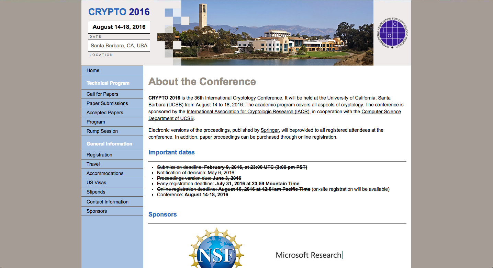

# Conference Website Template
This is a freelance project for IACR (International Association for Cryptologic Research).

They requested a makeover of their conference website, with the main concerns that it would be mobile friendly and look more modern. Their intention is to use this as a template for future conferences, including Crypto, Asiacrypt, and Eurocrypt.

For posterity, here's a screenshot of the 2016 website (the last year before I was commissioned to improve the site):

